# OSS PR Radar

OSS PR Radar discovers high-value code contributions in agent runtimes and AI
infrastructure, then carries qualified work through a local, evidence-gated PR
workflow. Its primary metric is the rolling **SubmitReady hit rate**. Merge count
is recorded as a lagging outcome, never used to judge discovery quality.

## What Runs Automatically

- Hourly GitHub discovery across agent runtime, MCP, tool calling, structured
  output, workflow/state, inference serving, scheduling, and cache projects.
- Full issue comments and timeline reads, recursive repository-policy discovery,
  claim detection, related PR strength analysis, and hardware checks.
- DeepSeek semantic review as a negative/re-ranking signal. It cannot authorize
  work or override a deterministic gate.
- Signed, expiring cloud-to-local intents that contain no executable prompt.
- Local live revalidation before a Codex task is created.
- Exact source-repository projects and isolated worktrees for implementation;
  the radar project never substitutes for the target repository.
- Write-ahead task creation with a durable `CREATING` state and persisted
  `clientThreadId`; an unresolved asynchronous request can never be dispatched
  a second time merely because its lease or queue intent expired.
- Workspace-local task context and result files. Child tasks never open the
  Radar or Plan Hub databases and never need elevated filesystem permission;
  the privileged controller owns lifecycle updates and publication.
- Publication requests and short-lived permits bound to the exact commit,
  branch, fork owner, base branch, PR title, and PR body digest.
- Idempotent publication receipts: cross-fork PR lookup uses the exact REST
  head filter with bounded visibility retries, while ambiguous effects can only
  be reconciled read-only and successful PR creation releases dispatch capacity
  in the same transaction.
- Maintainer/policy watch, existing-PR follow-up, Feishu outbox delivery, state
  integrity checks, and natural-schedule health alerts.
- Parallel watch/PR-follow-up jobs, bounded parallel policy-file reads,
  SHA-bound repository-policy caching, one shared recursive policy classifier
  for scan/live gates, and a dedicated cross-run recheck budget that never uses
  a cooldown.
- A single local controller thread plus explicit alerts when a signed intent
  remains undispatched for more than one hourly controller cycle.
- A durable, live-rechecked opportunity backlog: unchanged or transiently
  unreadable issues keep their signed intent, while ownership, closure, strong
  competing PRs, or policy drift force a fresh decision before dispatch.
- A 24-item independent recheck lane ordered by original wait time, with prior
  actionable candidates promoted ahead of ordinary deferred items. Rechecks
  never use a cooldown and cannot starve behind fresh discovery.

## Scan Scope

Every hour directly polls 52 mature repositories and also runs a bounded
dynamic GitHub search for Agent/AI-infrastructure repositories outside the
curated list. The fixed scope is grouped by the code surface it contributes:

```text
Agent runtimes:
  LangGraph, PydanticAI, AutoGen, Agent Framework, smolagents, LlamaIndex,
  Agno, CrewAI, mem0, OpenHands, Letta, Haystack, DSPy, Google ADK
  (Python/Java/JS), Strands Agents, CAMEL, Mastra, AgentScope, browser-use

Tools, MCP, coding, browser, and realtime agents:
  MCP Python/TypeScript/Java/C# SDKs, MCP Servers, MCP Inspector, mcp-use,
  FastMCP, OpenAI Agents SDK, Semantic Kernel, Stagehand, Composio, LiveKit
  Agents, Pipecat, Continue, goose, OpenCode, Cline

Gateways, evals, observability, and workflow platforms:
  LiteLLM, Vercel AI SDK, Langfuse, Phoenix, Promptfoo, Dify, Langflow,
  Flowise, RAGFlow, NVIDIA NeMo Agent Toolkit

Inference serving:
  vLLM, SGLang, NVIDIA Dynamo
```

The scan artifact records the fixed scope both as a flat list and by domain,
plus queried, matched, qualified, and deeply inspected sets. Dynamic discoveries
must still pass the mature-repository and real-code-surface gates.
`openai/codex` remains explicitly excluded.

## Trust Boundaries

```mermaid
flowchart LR
  G["GitHub read-only scan"] --> S["Validated scan artifact"]
  S --> Q["HMAC-signed dispatch intent"]
  Q --> L["Local SQLite ledger"]
L --> V["Live issue, policy, PR, hardware recheck"]
V --> C["Durable CREATING receipt"]
C --> T["Codex worktree task"]
T --> R["Workspace result evidence"]
  R --> B["Independent publication broker"]
  B --> P["Short-lived commit and PR-payload permit"]
  P --> E["Idempotent push and PR executor"]
```



Cloud jobs cannot create local tasks. Issue text cannot select a prompt, project,
worktree, branch, or publication command. The local bridge generates the exact
two-line task input only after signature and live-evidence checks:

```text
[$gh-issue-pr](/Users/oxygen/.codex/skills/gh-issue-pr/SKILL.md)
https://github.com/owner/repo/issues/123
```

Repositories that explicitly require AI-use disclosure or prohibit AI-assisted
contributions are held for the user. CLA requirements do not block PR creation,
but the system never accepts a CLA. DCO sign-off is permitted only with the
user's configured Git identity and is revalidated before publication.

## Setup

Requirements: Python 3.11+, authenticated `gh`, macOS Codex Desktop for local
dispatch, and the repository secrets listed below.

```bash
python -m pip install -e .
python scripts/configure_dispatch_signing.py \
  --repo Oxygen56/oss-pr-radar --mode canary
python scripts/state_branch.py migrate
```

GitHub Actions secrets:

- `DEEPSEEK_API_KEY`
- `FEISHU_APP_ID`
- `FEISHU_APP_SECRET`
- `FEISHU_CHAT_ID`
- `RADAR_DISPATCH_HMAC_KEY`

The signing setup stores the local copy in macOS Keychain and sends the same
value to GitHub Actions without writing it to the repository. `canary` mode
allows one active implementation at a time. `shadow` performs live audits
without creating tasks; `active` removes the one-task limit.

## Local Commands

```bash
# Read, verify, and ingest the latest signed cloud queue
python scripts/local_dispatch_bridge.py sync

# Pure local read: no clone, project lookup, or task creation
python scripts/local_dispatch_bridge.py list

# Alert when a signed intent survives more than one controller cycle
python scripts/local_dispatch_bridge.py alerts --min-age-minutes 70 --notify

# Repair workspace-local task contexts and ingest completed task results
python scripts/local_dispatch_bridge.py context-sync
python scripts/local_dispatch_bridge.py ingest-results

# Advance independently revalidated publication requests
python scripts/local_dispatch_bridge.py publication-run

# Rolling controllable quality metrics
python scripts/local_dispatch_bridge.py metrics --days 30

# Independent GitHub Actions schedule check (manual/fallback freshness is separate)
python scripts/check_workflow_health.py --notify --repair
```

The hourly Codex heartbeat reuses one controller task, calls `sync`, claims each pending intent through a
fresh live audit, creates only the authorized worktree task in the exact source
repository project, verifies its timestamped lifecycle title, prompt, repository
origin, and worktree identity, then commits a receipt. It retries an obviously
empty task at most once through a write-ahead recovery receipt. It archives a
task only after that task records `AUDIT_NO_GO` and its title has first been
synchronized to the visible `[无价值]` lifecycle prefix. If asynchronous
worktree creation returns only a client ID, the controller can reconcile the
unique prompt/origin/worktree match before the next lifecycle action. The
creation request remains in durable `CREATING` state until that match is
committed or the desktop API explicitly rejects the request before returning
an external ID. Child tasks report only through the Git-ignored
`.oss-pr-radar/` directory; the controller ingests outcomes and executes the
permit-bound publication path.
Each sync also supersedes uncommitted local intents withdrawn from the latest
signed cloud queue, so an older controller cannot dispatch a retracted decision.

## Development

```bash
python -m pip install pytest==9.1.1 ruff==0.16.1
ruff check src scripts tests
PYTHONPATH=src pytest -q
python -m compileall -q src scripts
actionlint .github/workflows/*.yml
```

See [architecture](docs/architecture.md), [operations](docs/operations.md), and
[threat model](docs/threat-model.md) for the complete contract.
