# OSS PR Radar

OSS PR Radar discovers high-value code contributions in agent runtimes and AI
infrastructure, then carries qualified work through a local, evidence-gated PR
workflow. Its primary metric is the rolling **SubmitReady hit rate**. Merge count
is recorded as a lagging outcome, never used to judge discovery quality.

## What Runs Automatically

- Hourly GitHub discovery across agent runtime, MCP, tool calling, structured
  output, workflow/state, inference serving, scheduling, and cache projects.
- Full issue comments and timeline reads, recursive repository-policy discovery,
  claim detection, related PR strength analysis, and hardware checks.
- DeepSeek semantic review as a negative/re-ranking signal. It cannot authorize
  work or override a deterministic gate.
- Signed, expiring cloud-to-local intents that contain no executable prompt.
- Local live revalidation before a Codex task is created.
- Exact source-repository projects and isolated worktrees for implementation;
  the radar project never substitutes for the target repository.
- Publication requests and short-lived permits bound to the exact commit,
  branch, fork owner, base branch, PR title, and PR body digest.
- Maintainer/policy watch, existing-PR follow-up, Feishu outbox delivery, state
  integrity checks, and natural-schedule health alerts.

## Trust Boundaries

```mermaid
flowchart LR
  G["GitHub read-only scan"] --> S["Validated scan artifact"]
  S --> Q["HMAC-signed dispatch intent"]
  Q --> L["Local SQLite ledger"]
  L --> V["Live issue, policy, PR, hardware recheck"]
  V --> T["Codex worktree task"]
  T --> R["SubmitReady evidence"]
  R --> B["Independent publication broker"]
  B --> P["Short-lived commit and PR-payload permit"]
  P --> E["Idempotent push and PR executor"]
```



Cloud jobs cannot create local tasks. Issue text cannot select a prompt, project,
worktree, branch, or publication command. The local bridge generates the exact
two-line task input only after signature and live-evidence checks:

```text
[$gh-issue-pr](/Users/oxygen/.codex/skills/gh-issue-pr/SKILL.md)
https://github.com/owner/repo/issues/123
```

Repositories that explicitly require AI-use disclosure or prohibit AI-assisted
contributions are held for the user. CLA requirements do not block PR creation,
but the system never accepts a CLA. DCO sign-off is permitted only with the
user's configured Git identity and is revalidated before publication.

## Setup

Requirements: Python 3.11+, authenticated `gh`, macOS Codex Desktop for local
dispatch, and the repository secrets listed below.

```bash
python -m pip install -e .
python scripts/configure_dispatch_signing.py \
  --repo Oxygen56/oss-pr-radar --mode canary
python scripts/state_branch.py migrate
```

GitHub Actions secrets:

- `DEEPSEEK_API_KEY`
- `FEISHU_APP_ID`
- `FEISHU_APP_SECRET`
- `FEISHU_CHAT_ID`
- `RADAR_DISPATCH_HMAC_KEY`

The signing setup stores the local copy in macOS Keychain and sends the same
value to GitHub Actions without writing it to the repository. `canary` mode
allows one active implementation at a time. `shadow` performs live audits
without creating tasks; `active` removes the one-task limit.

## Local Commands

```bash
# Read, verify, and ingest the latest signed cloud queue
python scripts/local_dispatch_bridge.py sync

# Pure local read: no clone, project lookup, or task creation
python scripts/local_dispatch_bridge.py list

# Rolling controllable quality metrics
python scripts/local_dispatch_bridge.py metrics --days 30

# Independent natural-schedule check
python scripts/check_workflow_health.py --notify --repair
```

The hourly Codex automation calls `sync`, claims each pending intent through a
fresh live audit, creates only the authorized worktree task in the exact source
repository project, verifies its timestamped lifecycle title, prompt, repository
origin, and worktree identity, then commits a receipt. It retries an obviously
empty task at most once through a write-ahead recovery receipt. It archives a
task only after that task records `AUDIT_NO_GO`.

## Development

```bash
python -m pip install pytest==9.1.1 ruff==0.16.1
ruff check src scripts tests
PYTHONPATH=src pytest -q
python -m compileall -q src scripts
actionlint .github/workflows/*.yml
```

See [architecture](docs/architecture.md), [operations](docs/operations.md), and
[threat model](docs/threat-model.md) for the complete contract.
