# OSS PR Radar

OSS PR Radar discovers high-value code contributions in agent runtimes, AI
infrastructure, and LLM algorithms, then carries qualified work through a local,
evidence-gated PR workflow. Its primary metric is the rolling **SubmitReady hit
rate**. Merge count is recorded as a lagging outcome, never used to judge
discovery quality.

## What Runs Automatically

- Hourly GitHub discovery across agent runtime, MCP, tool calling, structured
  output, workflow/state, inference serving, post-training, PEFT/modeling,
  distributed training, quantization/numerics, kernels, and evaluation projects.
- Independent inspection and candidate lanes for `agent_ai_infra` and
  `llm_algorithm`, so busy runtime repositories cannot starve algorithm work.
- Algorithm candidates must expose a concrete mechanism plus a numerical,
  reference, or controlled-experiment validation path. Configuration, CLI,
  installation, docs, wrappers, and ordinary integrations are rejected before
  local task creation.
- Full issue comments and timeline reads, recursive repository-policy discovery,
  claim detection, related PR strength analysis, and hardware checks.
- DeepSeek semantic review as a negative/re-ranking signal. It cannot authorize
  work or override a deterministic gate.
- If that service is unavailable, only already-authorized Agent/AI-infra
  candidates with a complete public reproduction, multiple code anchors, no
  competing work, normal contribution policy, compatible hardware, and no
  confirmation flags retain dispatch eligibility. Reports mark this as a
  deterministic fallback; algorithm, disclosure, assignment, competition, and
  ambiguous cases remain blocked.
- Signed, expiring cloud-to-local intents that contain no executable prompt.
- Local live revalidation before a Codex task is created.
- Exact source-repository projects and isolated worktrees for implementation;
  the radar project never substitutes for the target repository.
- Write-ahead task creation with a durable `CREATING` state and persisted
  `clientThreadId`; an unresolved asynchronous request can never be dispatched
  a second time merely because its lease or queue intent expired.
- Workspace-local task context and result files. Child tasks never open the
  Radar or Plan Hub databases and never need elevated filesystem permission;
  the privileged controller owns lifecycle updates and publication.
- Publication requests and short-lived permits bound to the exact commit,
  branch, fork owner, base branch, PR title, and PR body digest.
- Idempotent publication receipts: cross-fork PR lookup uses the exact REST
  head filter with bounded visibility retries, while ambiguous effects can only
  be reconciled read-only and successful PR creation releases dispatch capacity
  in the same transaction.
- Maintainer/policy watch, existing-PR follow-up, Feishu outbox delivery, state
  integrity checks, and natural-schedule health alerts.
- Existing Radar PRs return to their original Codex task only for maintainer
  change requests, still-current maintainer or review-bot threads, merge
  conflicts, or failures attributable to files changed by that PR. The
  controller refreshes the exact live PR head before the task runs, then
  fast-forwards the same public branch and reuses the same PR.
- Parallel watch/PR-follow-up jobs, bounded parallel policy-file reads,
  SHA-bound repository-policy caching, one shared recursive policy classifier
  for scan/live gates, and a dedicated cross-run recheck budget that never uses
  a cooldown.
- A single local controller thread plus explicit alerts only for stale leases
  or task-creation handoffs. Ordinary queued work is never labeled a timeout.
- A durable, live-rechecked opportunity backlog: unchanged or transiently
  unreadable issues keep their signed intent, while ownership, closure, strong
  competing PRs, or policy drift force a fresh decision before dispatch.
- A 24-item independent recheck lane ordered by original wait time, with prior
  actionable candidates promoted ahead of ordinary deferred items. Rechecks
  never use a cooldown and cannot starve behind fresh discovery.

## Scan Scope

Every hour directly polls 105 mature repositories and also runs bounded dynamic
GitHub searches for Agent/AI-infrastructure and LLM-algorithm repositories outside
the curated list. The fixed scope is grouped by the code surface it contributes:

```text
Agent runtimes:
  LangGraph, PydanticAI, AutoGen, Agent Framework, smolagents, LlamaIndex,
  Agno, CrewAI, mem0, OpenHands, DeerFlow, Letta, Haystack, DSPy, Google ADK
  (Python/Java/JS), Strands Agents, CAMEL, Mastra, AgentScope, browser-use

Tools, MCP, coding, browser, and realtime agents:
  MCP Python/TypeScript/Java/C# SDKs, MCP Servers, MCP Inspector, mcp-use,
  FastMCP, OpenAI Agents SDK, Semantic Kernel, Stagehand, Composio, LiveKit
  Agents, Pipecat, Continue, goose, OpenCode, Cline

Gateways, evals, observability, and workflow platforms:
  LiteLLM, Vercel AI SDK, Langfuse, Phoenix, Promptfoo, Dify, Langflow,
  Flowise, RAGFlow, NVIDIA NeMo Agent Toolkit

Inference serving:
  vLLM, SGLang, NVIDIA Dynamo

LLM post-training:
  TRL, verl, OpenRLHF, Open Instruct

Modeling, PEFT, and kernels:
  Transformers, PEFT, LLaMA-Factory, ms-swift, Axolotl, LitGPT,
  FlashAttention, xFormers, DeepSeek-V3, DeepGEMM

Distributed training, optimization, and quantization:
  Megatron-LM, DeepSpeed, TorchTitan, Accelerate, bitsandbytes, DeepEP

LLM evaluation:
  lm-evaluation-harness, LightEval
```

The scan artifact records the fixed scope both as a flat list and by domain,
plus queried, matched, qualified, and deeply inspected sets. Dynamic discoveries
must still pass the mature-repository and real-code-surface gates.
`openai/codex` remains explicitly excluded.

## Trust Boundaries

```mermaid
flowchart LR
  G["GitHub read-only scan"] --> S["Validated scan artifact"]
  S --> Q["HMAC-signed dispatch intent"]
  Q --> L["Local SQLite ledger"]
L --> V["Live issue, policy, PR, hardware recheck"]
V --> C["Durable CREATING receipt"]
C --> T["Codex worktree task"]
T --> R["Workspace patch and result evidence"]
R --> C2["Controller-validated local commit"]
C2 --> B["Independent publication broker"]
  B --> P["Short-lived commit and PR-payload permit"]
  P --> E["Idempotent push and PR executor"]
```



Cloud jobs cannot create local tasks. Issue text cannot select a prompt, project,
worktree, branch, or publication command. The local bridge generates the exact
two-line task input only after signature and live-evidence checks:

```text
[$gh-issue-pr](/Users/oxygen/.codex/skills/gh-issue-pr/SKILL.md)
https://github.com/owner/repo/issues/123
```

Repositories that explicitly require AI-use disclosure or prohibit AI-assisted
contributions cannot enter automatic publication. CLA requirements do not block
PR creation, but the system never accepts a CLA. DCO sign-off is permitted only
with the user's configured Git identity and is revalidated before publication.
Broader relicensing or proprietary-use contribution agreements are not treated
as ordinary CLA/DCO and are filtered before task creation.

A disclosure-required repository may still receive a private local-fix task only
when the issue is otherwise actionable. A semantic `WAIT_MAINTAINER` result is
dispatchable only when its structured reason is `DISCLOSURE_ONLY`; assignment,
design, evidence, duplicate, or unclassified waits remain in discovery and do
not create a desktop task.

## Setup

Requirements: Python 3.11+, authenticated `gh`, macOS Codex Desktop for local
dispatch, and the repository secrets listed below.

```bash
python -m pip install -e .
python scripts/configure_dispatch_signing.py \
  --repo Oxygen56/oss-pr-radar --mode canary
python scripts/state_branch.py migrate
```

GitHub Actions secrets:

- `DEEPSEEK_API_KEY`
- `FEISHU_APP_ID`
- `FEISHU_APP_SECRET`
- `FEISHU_CHAT_ID`
- `RADAR_DISPATCH_HMAC_KEY`

The signing setup stores the local copy in macOS Keychain and sends the same
value to GitHub Actions without writing it to the repository. `canary` limits
automatic public publication, not private Codex investigation tasks. `shadow`
performs live audits without creating tasks; `active` enables normal publication.

## Local Commands

The controller heartbeat follows the versioned
[controller protocol](docs/controller-heartbeat.md). The daily War Room is a
separate heartbeat that runs at 09:00 in its own fixed audit thread. The hourly
controller and daily audit use different durable thread targets because one
thread can own only one heartbeat. Both prompts are generated by the
release-bound automation snapshot command; do not hand-edit them, swap their
thread targets, or point them at runtime scripts, legacy War Room paths, or a
ledger file.

```bash
# Run the complete deterministic hourly controller cycle from the active release
python current-release/scripts/controller_cycle.py \
  --root /Users/oxygen/Documents/github/oss-pr-radar \
  --code-root /Users/oxygen/Documents/github/oss-pr-radar/current-release

# Run the daily War Room cycle from the active release; delivery is explicit
python current-release/scripts/daily_war_room_cycle.py \
  --runtime-root /Users/oxygen/Documents/github/oss-pr-radar --send

# Export exact release-bound commands and run acceptance checks
python current-release/scripts/automation_command_contracts.py \
  --runtime-root /Users/oxygen/Documents/github/oss-pr-radar

# Read the actual Codex automation TOML files and sign a release-bound snapshot
python current-release/scripts/stage7_evidence.py automation-snapshot \
  --runtime-root /Users/oxygen/Documents/github/oss-pr-radar \
  --heartbeat-toml <heartbeat-automation.toml> \
  --daily-toml <daily-automation.toml> \
  --out <automation-snapshot.json>

# Derive current counts only from a verified Stage 6 public report/envelope
python current-release/scripts/stage7_evidence.py managed-counts \
  --runtime-root /Users/oxygen/Documents/github/oss-pr-radar \
  --report <stage6-report.json> --envelope <stage6-envelope.json> \
  --code-head <verified-release-head> --out <managed-counts-evidence.json>

# Production-strict acceptance requires both independently generated evidence files.
# The default output is shareable; add --private only for restricted operations logs.
python current-release/scripts/stage7_acceptance.py \
  --runtime-root /Users/oxygen/Documents/github/oss-pr-radar \
  --managed-counts-evidence <managed-counts-evidence.json> \
  --automation-snapshot <automation-snapshot.json>

# Every public bridge operation is bound to the active runtime and its
# operational authorization. There is no unauthenticated CLI mode.
RUNTIME_ROOT=/Users/oxygen/Documents/github/oss-pr-radar

# Read, verify, and ingest the latest signed cloud queue
python scripts/local_dispatch_bridge.py --runtime-root "$RUNTIME_ROOT" sync

# Import signed write intents only; no context recovery or publication work
python scripts/local_dispatch_bridge.py --runtime-root "$RUNTIME_ROOT" queue-import

# Build and activate a clean immutable release; durable state is preserved and
# runtime-health deployment identity is updated atomically with the pointer
python scripts/deploy_local_runtime.py \
  --target /Users/oxygen/Documents/github/oss-pr-radar

# Read-only runtime health and fault audit
python scripts/runtime_audit.py \
  --root /Users/oxygen/Documents/github/oss-pr-radar

# Inspect the runtime ledger after authorization (no clone or task creation)
python scripts/local_dispatch_bridge.py --runtime-root "$RUNTIME_ROOT" list

# Alert only on a stale lease or a stuck asynchronous task creation
python scripts/local_dispatch_bridge.py --runtime-root "$RUNTIME_ROOT" alerts --min-age-minutes 70 --notify

# Notify Feishu only after a Codex task has actually been created
python scripts/local_dispatch_bridge.py --runtime-root "$RUNTIME_ROOT" dispatch-notifications --notify

# Recover ledger receipts, repair task contexts, and ingest completed results
python scripts/local_dispatch_bridge.py --runtime-root "$RUNTIME_ROOT" context-recover
python scripts/local_dispatch_bridge.py --runtime-root "$RUNTIME_ROOT" context-sync
python scripts/local_dispatch_bridge.py --runtime-root "$RUNTIME_ROOT" ingest-results

# Detect and repair lifecycle title drift through the local Codex protocol
python scripts/local_dispatch_bridge.py --runtime-root "$RUNTIME_ROOT" title-reconcile

# Archive reconciled AUDIT_NO_GO tasks and commit the cleanup receipt
python scripts/local_dispatch_bridge.py --runtime-root "$RUNTIME_ROOT" cleanup-reconcile

# Inspect and transactionally reserve actionable follow-up for existing PR tasks
python scripts/local_dispatch_bridge.py --runtime-root "$RUNTIME_ROOT" pr-followup-list
python scripts/local_dispatch_bridge.py --runtime-root "$RUNTIME_ROOT" pr-followup-reserve \
  --thread-id THREAD_ID --wake-digest WAKE_DIGEST
python scripts/local_dispatch_bridge.py --runtime-root "$RUNTIME_ROOT" pr-followup-deliver \
  --thread-id THREAD_ID --wake-digest WAKE_DIGEST

# Prefetch only lockfile-declared dependencies, then resume incomplete validation.
# A stalled task resumes only when its review, code, dependency, or validation
# evidence differs from the evidence used for its previous continuation.
# There is no fixed cooldown, and unchanged evidence is not retried.
python scripts/local_dispatch_bridge.py --runtime-root "$RUNTIME_ROOT" validation-followup-list --min-age-minutes 90
python scripts/local_dispatch_bridge.py --runtime-root "$RUNTIME_ROOT" validation-followup-reserve \
  --thread-id THREAD_ID --result-digest RESULT_DIGEST
python scripts/local_dispatch_bridge.py --runtime-root "$RUNTIME_ROOT" validation-followup-deliver \
  --thread-id THREAD_ID --result-digest RESULT_DIGEST

# Advance independently revalidated publication requests
python scripts/local_dispatch_bridge.py --runtime-root "$RUNTIME_ROOT" publication-run

# Generate exact managed-counts first, then issue the short-lived stage-only permit.
# The permit is intentionally independent of the not-yet-created worker plist snapshot.
python current-release/scripts/stage7_evidence.py worker-staging-authorization \
  --runtime-root /Users/oxygen/Documents/github/oss-pr-radar \
  --managed-counts-evidence <managed-counts-evidence>
python current-release/scripts/install_local_publication_workers.py \
  --runtime-root /Users/oxygen/Documents/github/oss-pr-radar --stage
# After staging, update the two automations and create the snapshot from the
# actual TOML files and the actual staged plist bytes before strict preflight.
# After strict preflight passes, issue full operational authorization.
python current-release/scripts/stage7_evidence.py operational-authorization \
  --runtime-root /Users/oxygen/Documents/github/oss-pr-radar \
  --managed-counts-evidence <managed-counts-evidence> \
  --automation-snapshot <automation-snapshot>
# Load workers only after operational authorization has been issued
python current-release/scripts/install_local_publication_workers.py \
  --runtime-root /Users/oxygen/Documents/github/oss-pr-radar --activate

`--status` is a runtime-bound read-only check and does not require business
authorization. `--stage` requires the short-lived, signed stage-only permit;
`--activate`, `--ensure`, and `--uninstall` require the full operational
authorization before writing a plist or changing a service. The stage permit
cannot load a service or perform business work. The historical
`install_local_publication_agent.py` entrypoint only forwards to this
three-worker installer; it cannot install or start the old monolithic or
fast-only service.

# Rolling controllable quality metrics
python scripts/local_dispatch_bridge.py --runtime-root "$RUNTIME_ROOT" metrics --days 30

# Independent GitHub Actions schedule check (manual/fallback freshness is separate)
python scripts/check_workflow_health.py --runtime-root "$RUNTIME_ROOT" \
  --max-effective-age-minutes 110 --notify --repair
```

`publication_executor.py` is an internal bridge child, not a user entrypoint.
Its `push` and `create-pr` commands require the same `--runtime-root` and
operational authorization, and reject direct unauthenticated invocation.

PR follow-up keeps all failing checks as diagnostic evidence, but only notifies
Feishu or wakes a task for maintainer requests, merge conflicts, unresolved
review threads, failures tied to files changed by the current branch, or
unattributed compiler/test failures that match the language of changed files.
When the target branch has advanced, the controller prepares a signed local
integration merge so validation runs against the same combined code shape as
GitHub CI. For a merge conflict, the signed snapshot includes both the PR head
and target-branch head; the controller aligns both refs before waking the task.

The hourly Codex heartbeat reuses one controller task and invokes the single
deterministic `controller_cycle.py` entry point. It creates every issue task in
the configured `github` project while source code lives in an isolated,
controller-owned worktree, so UI ownership and repository isolation are
independent.
Existing PR follow-ups, incomplete validation, and recoverable interrupted tasks
consume the shared task slot before new discovery, so near-publication work
cannot be starved by a growing issue backlog. The claim command enforces the
same priority even if a controller turn executes its stages out of order.
The controller verifies the timestamped lifecycle title, prompt, project root,
repository origin, and worktree identity before committing a receipt. It retries an obviously
empty task at most once through a write-ahead recovery receipt. It archives a
task only after that task records `AUDIT_NO_GO` and its title has first been
synchronized to the visible `[无价值]` lifecycle prefix. If asynchronous
evidence later moves that same current task out of `AUDIT_NO_GO`, the controller
first unarchives it through a fresh restore receipt, then synchronizes the new
valuable lifecycle title before continuing publication. Historical archive
events never make a task permanently invisible. If asynchronous
worktree creation returns only a client ID, the controller can reconcile the
unique prompt/origin/worktree match before the next lifecycle action. The
creation request remains in durable `CREATING` state until that match is
committed or the desktop API explicitly rejects the request before returning
an external ID. Child tasks report only through the Git-ignored
`.oss-pr-radar/` directory. A per-issue bootstrap context in the GitHub project
routes the task into its exact worktree without changing the canonical two-line
prompt. The controller ingests outcomes and executes the
permit-bound publication path. Actionable unresolved review, conflict, or
branch-owned CI evidence wakes the original task with the same canonical two-line prompt; the
controller first aligns its worktree to the exact live PR head. A subsequent
validated patch is published only as a fast-forward update to that exact open
PR, never as a competing replacement PR.
An independent macOS LaunchAgent runs only the idempotent result-ingestion and
permit-bound publication path every 20 seconds. Every committed change awaiting
publication, including an existing PR update or conflict resolution, is first
reviewed by an ephemeral read-only process bound to a controller-private receipt.
The reviewer starts outside the target repository with project instructions and
secret environment variables disabled; it does not create another Codex sidebar
task, and a child task cannot self-attest this gate. The privileged publication
queue rechecks the private receipt even for requests created before an upgrade.
When a task result or lifecycle
transition releases capacity, it immediately invokes the same serialized drain
to advance one next task. An idle cycle does not scan GitHub, invoke an LLM,
create tasks, or rewrite active task contexts; the hourly controller remains a
reconciliation fallback. DeepSeek Harness is a separate automation and does not
share the Radar ledger, WIP slot, task contexts, or quality metrics.
Each sync also supersedes uncommitted local intents withdrawn from the latest
signed cloud queue, so an older controller cannot dispatch a retracted decision.
Before queue ingestion, sync verifies the private per-issue context in both its
shared and worktree locations and reconstructs missing lifecycle/publication
rows. For a clean checkout still pinned to its published commit, it also restores
the exact consumed-result digest so an old `FIX_READY` file cannot request a
second publication. The fast local publisher performs the same recovery first
and stops before every public action when recovery or result validation fails.
A lost local database therefore cannot turn a completed issue into a new task,
detach an existing pull request from follow-up, or replay an old result. Any
mirror, digest, repository, permission, or controller-boundary mismatch stops
dispatch and publication.

## Development

```bash
python -m pip install pytest==9.1.1 ruff==0.16.1
ruff check src scripts tests
PYTHONPATH=src pytest -q
python -m compileall -q src scripts
ruby -ryaml -e 'ARGV.each { |path| YAML.load_file(path); puts path }' -- \
  .github/workflows/ci.yml .github/workflows/health.yml .github/workflows/radar.yml
```

The Stage 6 verification manifest runs the same Ruby check against all three
hidden workflow files. It parses each file separately and exits non-zero on
the first YAML error; it does not rely on a shell glob or report that the
repository has no YAML files.

Generate the manifest only after every versioned command has a canonical
passing result. `--run` executes the versioned commands and records their
exit-code/output digests; `--results` accepts an independently captured JSON
object with exactly the same command IDs, `status="passed"`, `exitCode=0`, and
64-character `outputDigest` values:

```bash
python current-release/scripts/stage6_manifest.py \
  --artifact-root <verification-report-root> \
  --verification-out <verification-root>/verification-manifest.json \
  --run
```

The versioned `code-integrity` entry is release-aware: it verifies the active
release manifest (or the exact clean development worktree) and never searches
for a parent `.git`. A developer may still run `git diff --check` separately as
an unbound local hygiene check.

Keep `<verification-root>` and the final Stage 6 rehearsal root separate. The
command atomically writes the standalone 0600 verification manifest, which is
the exact file consumed by `stage6_compact_rehearsal.py`; do not copy the
embedded report field or reuse the report root for the final rehearsal:

```bash
python current-release/scripts/stage6_compact_rehearsal.py \
  --artifact-root <final-rehearsal-root> \
  --verification-manifest <verification-root>/verification-manifest.json \
  ...other required source/live-state arguments...
```

See [architecture](docs/architecture.md), [operations](docs/operations.md), and
[threat model](docs/threat-model.md) for the complete contract.
