# OSS PR Radar

OSS PR Radar discovers high-value code contributions in agent runtimes, AI
infrastructure, and LLM algorithms, then carries qualified work through a local,
evidence-gated PR workflow. Its primary metric is the rolling **SubmitReady hit
rate**. Merge count is recorded as a lagging outcome, never used to judge
discovery quality.

## What Runs Automatically

- Hourly GitHub discovery across agent runtime, MCP, tool calling, structured
  output, workflow/state, inference serving, post-training, PEFT/modeling,
  distributed training, quantization/numerics, kernels, and evaluation projects.
- Independent inspection and candidate lanes for `agent_ai_infra` and
  `llm_algorithm`, so busy runtime repositories cannot starve algorithm work.
- Algorithm candidates must expose a concrete mechanism plus a numerical,
  reference, or controlled-experiment validation path. Configuration, CLI,
  installation, docs, wrappers, and ordinary integrations are rejected before
  local task creation.
- Full issue comments and timeline reads, recursive repository-policy discovery,
  claim detection, related PR strength analysis, and hardware checks.
- DeepSeek semantic review as a negative/re-ranking signal. It cannot authorize
  work or override a deterministic gate.
- Signed, expiring cloud-to-local intents that contain no executable prompt.
- Local live revalidation before a Codex task is created.
- Exact source-repository projects and isolated worktrees for implementation;
  the radar project never substitutes for the target repository.
- Write-ahead task creation with a durable `CREATING` state and persisted
  `clientThreadId`; an unresolved asynchronous request can never be dispatched
  a second time merely because its lease or queue intent expired.
- Workspace-local task context and result files. Child tasks never open the
  Radar or Plan Hub databases and never need elevated filesystem permission;
  the privileged controller owns lifecycle updates and publication.
- Publication requests and short-lived permits bound to the exact commit,
  branch, fork owner, base branch, PR title, and PR body digest.
- Idempotent publication receipts: cross-fork PR lookup uses the exact REST
  head filter with bounded visibility retries, while ambiguous effects can only
  be reconciled read-only and successful PR creation releases dispatch capacity
  in the same transaction.
- Maintainer/policy watch, existing-PR follow-up, Feishu outbox delivery, state
  integrity checks, and natural-schedule health alerts.
- Existing Radar PRs return to their original Codex task only for maintainer
  change requests, still-current maintainer or review-bot threads, merge
  conflicts, or failures attributable to files changed by that PR. The
  controller refreshes the exact live PR head before the task runs, then
  fast-forwards the same public branch and reuses the same PR.
- Parallel watch/PR-follow-up jobs, bounded parallel policy-file reads,
  SHA-bound repository-policy caching, one shared recursive policy classifier
  for scan/live gates, and a dedicated cross-run recheck budget that never uses
  a cooldown.
- A single local controller thread plus explicit alerts only for stale leases
  or task-creation handoffs. Ordinary queued work is never labeled a timeout.
- A durable, live-rechecked opportunity backlog: unchanged or transiently
  unreadable issues keep their signed intent, while ownership, closure, strong
  competing PRs, or policy drift force a fresh decision before dispatch.
- A 24-item independent recheck lane ordered by original wait time, with prior
  actionable candidates promoted ahead of ordinary deferred items. Rechecks
  never use a cooldown and cannot starve behind fresh discovery.

## Scan Scope

Every hour directly polls 74 mature repositories and also runs bounded dynamic
GitHub searches for Agent/AI-infrastructure and LLM-algorithm repositories outside
the curated list. The fixed scope is grouped by the code surface it contributes:

```text
Agent runtimes:
  LangGraph, PydanticAI, AutoGen, Agent Framework, smolagents, LlamaIndex,
  Agno, CrewAI, mem0, OpenHands, Letta, Haystack, DSPy, Google ADK
  (Python/Java/JS), Strands Agents, CAMEL, Mastra, AgentScope, browser-use

Tools, MCP, coding, browser, and realtime agents:
  MCP Python/TypeScript/Java/C# SDKs, MCP Servers, MCP Inspector, mcp-use,
  FastMCP, OpenAI Agents SDK, Semantic Kernel, Stagehand, Composio, LiveKit
  Agents, Pipecat, Continue, goose, OpenCode, Cline

Gateways, evals, observability, and workflow platforms:
  LiteLLM, Vercel AI SDK, Langfuse, Phoenix, Promptfoo, Dify, Langflow,
  Flowise, RAGFlow, NVIDIA NeMo Agent Toolkit

Inference serving:
  vLLM, SGLang, NVIDIA Dynamo

LLM post-training:
  TRL, verl, OpenRLHF, Open Instruct

Modeling, PEFT, and kernels:
  Transformers, PEFT, LLaMA-Factory, ms-swift, Axolotl, LitGPT,
  FlashAttention, xFormers, DeepSeek-V3, DeepGEMM

Distributed training, optimization, and quantization:
  Megatron-LM, DeepSpeed, TorchTitan, Accelerate, bitsandbytes, DeepEP

LLM evaluation:
  lm-evaluation-harness, LightEval
```

The scan artifact records the fixed scope both as a flat list and by domain,
plus queried, matched, qualified, and deeply inspected sets. Dynamic discoveries
must still pass the mature-repository and real-code-surface gates.
`openai/codex` remains explicitly excluded.

## Trust Boundaries

```mermaid
flowchart LR
  G["GitHub read-only scan"] --> S["Validated scan artifact"]
  S --> Q["HMAC-signed dispatch intent"]
  Q --> L["Local SQLite ledger"]
L --> V["Live issue, policy, PR, hardware recheck"]
V --> C["Durable CREATING receipt"]
C --> T["Codex worktree task"]
T --> R["Workspace patch and result evidence"]
R --> C2["Controller-validated local commit"]
C2 --> B["Independent publication broker"]
  B --> P["Short-lived commit and PR-payload permit"]
  P --> E["Idempotent push and PR executor"]
```



Cloud jobs cannot create local tasks. Issue text cannot select a prompt, project,
worktree, branch, or publication command. The local bridge generates the exact
two-line task input only after signature and live-evidence checks:

```text
[$gh-issue-pr](/Users/oxygen/.codex/skills/gh-issue-pr/SKILL.md)
https://github.com/owner/repo/issues/123
```

Repositories that explicitly require AI-use disclosure or prohibit AI-assisted
contributions cannot enter automatic publication. CLA requirements do not block
PR creation, but the system never accepts a CLA. DCO sign-off is permitted only
with the user's configured Git identity and is revalidated before publication.
Broader relicensing or proprietary-use contribution agreements are not treated
as ordinary CLA/DCO and are filtered before task creation.

## Setup

Requirements: Python 3.11+, authenticated `gh`, macOS Codex Desktop for local
dispatch, and the repository secrets listed below.

```bash
python -m pip install -e .
python scripts/configure_dispatch_signing.py \
  --repo Oxygen56/oss-pr-radar --mode canary
python scripts/state_branch.py migrate
```

GitHub Actions secrets:

- `DEEPSEEK_API_KEY`
- `FEISHU_APP_ID`
- `FEISHU_APP_SECRET`
- `FEISHU_CHAT_ID`
- `RADAR_DISPATCH_HMAC_KEY`

The signing setup stores the local copy in macOS Keychain and sends the same
value to GitHub Actions without writing it to the repository. `canary` limits
automatic public publication, not private Codex investigation tasks. `shadow`
performs live audits without creating tasks; `active` enables normal publication.

## Local Commands

```bash
# Read, verify, and ingest the latest signed cloud queue
python scripts/local_dispatch_bridge.py sync

# Pure local read: no clone, project lookup, or task creation
python scripts/local_dispatch_bridge.py list

# Alert only on a stale lease or a stuck asynchronous task creation
python scripts/local_dispatch_bridge.py alerts --min-age-minutes 70 --notify

# Notify Feishu only after a Codex task has actually been created
python scripts/local_dispatch_bridge.py dispatch-notifications --notify

# Repair workspace-local task contexts and ingest completed task results
python scripts/local_dispatch_bridge.py context-sync
python scripts/local_dispatch_bridge.py ingest-results

# Inspect and transactionally reserve actionable follow-up for existing PR tasks
python scripts/local_dispatch_bridge.py pr-followup-list
python scripts/local_dispatch_bridge.py pr-followup-reserve \
  --thread-id THREAD_ID --wake-digest WAKE_DIGEST
python scripts/local_dispatch_bridge.py pr-followup-commit \
  --thread-id THREAD_ID --wake-digest WAKE_DIGEST

# Prefetch only lockfile-declared dependencies, then resume incomplete validation
python scripts/local_dispatch_bridge.py validation-followup-list
python scripts/local_dispatch_bridge.py validation-followup-reserve \
  --thread-id THREAD_ID --result-digest RESULT_DIGEST --prefetch-complete
python scripts/local_dispatch_bridge.py validation-followup-commit \
  --thread-id THREAD_ID --result-digest RESULT_DIGEST

# Advance independently revalidated publication requests
python scripts/local_dispatch_bridge.py publication-run

# Install the no-LLM local completion collector (20-second maximum pickup delay)
python scripts/install_local_publication_agent.py

# Rolling controllable quality metrics
python scripts/local_dispatch_bridge.py metrics --days 30

# Independent GitHub Actions schedule check (manual/fallback freshness is separate)
python scripts/check_workflow_health.py --max-effective-age-minutes 65 --notify --repair
```

PR follow-up keeps all failing checks as diagnostic evidence, but only notifies
Feishu or wakes a task for maintainer requests, merge conflicts, unresolved
review threads, or failures tied to files changed by the current branch. For a
merge conflict, the signed snapshot includes both the PR head and target-branch
head; the controller aligns both refs before waking the task.

The hourly Codex heartbeat reuses one controller task, calls `sync`, claims each pending intent through a
fresh live audit, and creates every issue task in the single configured GitHub
project. Source code still lives in an isolated controller-owned Git worktree
under that project, so UI ownership and repository isolation are independent.
The controller verifies the timestamped lifecycle title, prompt, project root,
repository origin, and worktree identity before committing a receipt. It retries an obviously
empty task at most once through a write-ahead recovery receipt. It archives a
task only after that task records `AUDIT_NO_GO` and its title has first been
synchronized to the visible `[无价值]` lifecycle prefix. If asynchronous
evidence later moves that same current task out of `AUDIT_NO_GO`, the controller
first unarchives it through a fresh restore receipt, then synchronizes the new
valuable lifecycle title before continuing publication. Historical archive
events never make a task permanently invisible. If asynchronous
worktree creation returns only a client ID, the controller can reconcile the
unique prompt/origin/worktree match before the next lifecycle action. The
creation request remains in durable `CREATING` state until that match is
committed or the desktop API explicitly rejects the request before returning
an external ID. Child tasks report only through the Git-ignored
`.oss-pr-radar/` directory. A per-issue bootstrap context in the GitHub project
routes the task into its exact worktree without changing the canonical two-line
prompt. The controller ingests outcomes and executes the
permit-bound publication path. Actionable unresolved review, conflict, or
branch-owned CI evidence wakes the original task with the same canonical two-line prompt; the
controller first aligns its worktree to the exact live PR head. A subsequent
validated patch is published only as a fast-forward update to that exact open
PR, never as a competing replacement PR.
The legacy Done-Gate hourly wrapper invokes `scripts/run_scanner.py`, so local
traces and GitHub Actions share this repository's scanner and decision revision
instead of maintaining a second copy of discovery rules.
An independent macOS LaunchAgent runs only the idempotent result-ingestion and
permit-bound publication path every 20 seconds. It does not scan GitHub, invoke
an LLM, create tasks, or rewrite active task contexts; the hourly controller
remains a recovery fallback.
Each sync also supersedes uncommitted local intents withdrawn from the latest
signed cloud queue, so an older controller cannot dispatch a retracted decision.

## Development

```bash
python -m pip install pytest==9.1.1 ruff==0.16.1
ruff check src scripts tests
PYTHONPATH=src pytest -q
python -m compileall -q src scripts
actionlint .github/workflows/*.yml
```

See [architecture](docs/architecture.md), [operations](docs/operations.md), and
[threat model](docs/threat-model.md) for the complete contract.
